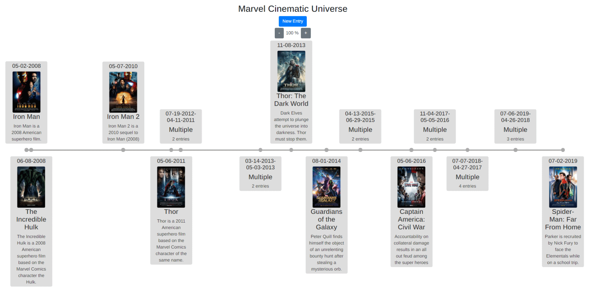
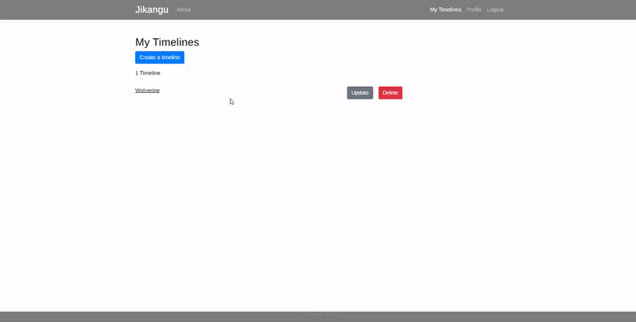
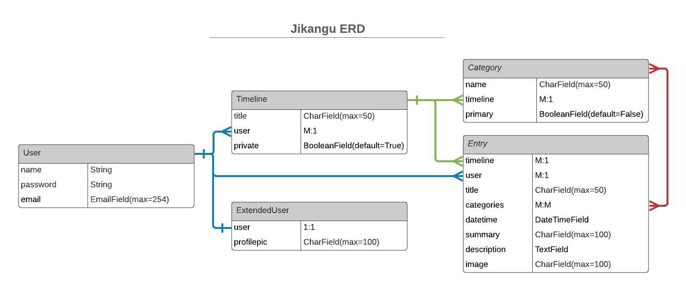

# Jikangu

Jikangu is a web app that makes it simple to create timelines of your favorite subjects. Whether its world events, historical figures, or your favorite super heroes, Jikangu lets you visually depict these items in  an easy to read, chronological timeline.

Links:

- [Jikangu](https://jikangu.herokuapp.com/)

- [Jikangu Backend Repository](https://github.com/evan-woodworth/timeline_backend)





<hr>

## Key Features

The easy-to-navigate user interface allows a user to:
- Create any number of timelines for any subject with virtually unlimited entries
- Update or delete timelines and entries
- Zoom and manipulate the timeline, dynamically merging or unmerging entries that collide
- Access your timeline from your phone

## How it Works

At it's core, Jikangu follows REACT best practices. It breaks functionality apart into separate, reusable components that pass information downward as props. It uses state variables, hooks, and conditional rendering to provide the user with a streamlined, yet highly customizable experience.

## Key Components

```
            My Timelines - queries the database for a user's 
                 |          basic timeline information
                 v
    Feeds an array of the user's 
    basic timeline information to
                 |
                 v
         Timeline Container - queries the database for a specific timeline's
                 |              information, then processes the entries
                 v
    Feeds an array of entries to
                 |
                 v
           Timeline Show - Manages and displays the entries

            _________               .__            
            \_   ___ \  ____   ____ |  |           
            /    \  \/ /  _ \ /  _ \|  |           
            \     \___(  <_> |  <_> )  |__         
            \______  /\____/ \____/|____/         
                    \/                             
            __________                             
            \______   \ ____ _____    ____   ______
            |    |  _// __ \\__  \  /    \ /  ___/
            |    |   \  ___/ / __ \|   |  \\___ \ 
            |______  /\___  >____  /___|  /____  >
                    \/     \/     \/     \/     \/ 
```
<hr>

## Entity Relationship Diagram

The following ERD details the specific information stored by Jikangu's database, and the associations within.



### The Views

Jikangu's backend uses the following views for navigating the API:


| Method |  PATH                 |   Purpose
| ---    |  ----                 |   -------
| GET    |  /api/                |   Backend homepage with the most useful button
| POST   |  /api/login/          |   Allows users to login
| POST   |  /api/signup/         |   Allow users to create an account
| GET    |  /api/users/          |   Retrieves all users and their associated timelines
| GET    |  /api/users/:id/      |   Retrieves a specific user's information and their associated timelines
| GET    |  /api/timelines/      |   Retrieves all timelines
| POST   |  /api/timelines/      |   Creates a timeline
| GET    |  /api/timelines/:id/  |   Retrieves a specific timeline and its associated entries
| PUT    |  /api/timelines/:id/  |   Updates a specific timeline
| DELETE |  /api/timelines/:id/  |   Deletes a specific timeline
| GET    |  /api/entries/        |   Retrieves all entries and its associated timelines
| POST   |  /api/entries/        |   Creates an entry within the specified timeline
| GET    |  /api/entries/:id     |   Retrieves a specific entry within the specified timeline
| PUT    |  /api/entries/:id     |   Updates a specific entry within the specified timeline
| DELETE |  /api/entries/:id     |   Deletes a specific entry within the specified timeline

<hr>

## Code Snippets

### Backend Authentication

By leveraging the frontend authentication template, users are required to provide their credentials, via logging in or signing up, in order to manipulate the timeline. Several routes allow unauthenticated users to view data in order to see how the timeline functions before signing up. The following code handles the functionality of either creating a new user and providing them a token or by retrieving an unexpired token associated with the requesting user.

```py
class UserSerializerWithToken(serializers.ModelSerializer):
    token = serializers.SerializerMethodField()
    password = serializers.CharField(write_only=True)

    def get_token(self, user):
        jwt_payload_handler = api_settings.JWT_PAYLOAD_HANDLER
        jwt_encode_handler = api_settings.JWT_ENCODE_HANDLER

        payload = jwt_payload_handler(user)
        token = jwt_encode_handler(payload)
        return token

    def create(self, validated_data):
        password = validated_data.pop('password', None)
        instance = self.Meta.model(**validated_data)
        if password is not None:
            instance.set_password(password)
        instance.save()
        return instance

    class Meta:
        model = User
        fields = ('token', 'username', 'password', 'email')
```

### Data Flow - Entries

Every entry is processed before being placed on a displayed timeline.
1. The array of entries is sorted by datetime using a quicksort algorithm.
2. Each element is assigned a daySync value to place it chronologically on the timeline.
3. Calculations determine if entries will visually overlap, and overlapping entries are nested into a parent entry.
    - Calculated based on screen size, entry size, and current zoom factor.
    - Recalculated on screen resizing.
4. Each resulting entry is assigned an alternating side of the timeline.
5. The array of entries is stored in state.

### Displaying User's Timelines

On the back end, serializers determine what the api requests return. For example, here is the api request that asks for a user's basic timeline information: id, title, and private.

```py
class TimelineLinkSerializer(serializers.RelatedField):
    def to_representation(self, value):
        id = value.id
        title = value.title
        private = value.private
        return {'id': id, 'title':title, 'private':private}
```

On the front end, when a user selects a specific timeline to view, the basic information for that timeline is sent to the timeline container, which queries for the more specific entry information. The timeline's array of entries is then processed and displayed to the timeline.

The splitDateTime function takes an entry's datetime field, and provides data that we can use to place an entry on it's timeline.

```js
const splitDateTime = (datetime) => {
    let datetimeArray = datetime.split("T");
    let dateArray = datetimeArray[0].split('-');
    // daySync provides a rough calculation of where an entry sits on a timeline,
    // by multiplying the entry's year by it's day of the year.
    let daySync = parseInt(dateArray[0])*365+(30*(parseInt(dateArray[1])-1) + parseInt(dateArray[2]));
    return {'date':datetimeArray[0], 'time':datetimeArray[1], daySync}
}
```

### Displaying a Timeline's Entries

An entry is placed on the timeline through CSS styling, using variables passed from the component.

CSS:
```css
.timeline-entry-point {
	position: absolute;
	left: var(--line-position);
}
```
Javascript:
```js
<div key={i} className="timeline-entry-point" style={{'--line-position': entry.linePosition+"%"}}>
```
The following code block demonstrates the calculation and subsequent nesting of entries:

```js
// if --width-- is below a predetermined threshold, the timeline length and card size changes.
if (window.innerWidth <= 550) {
    width = 2000;
    cardWidth = 250;
}
// --wrangleWidth-- represents the calculated boundary to nest an entry, by percentage of the timeline.
let wrangleWidth = Math.floor(100*(cardWidth/(width*windowZoom)))+3
for (let i=0; i < entryList.length-1; i++) {
    let checkAgain = true;
    let nestingHappened = false;
    let newEntry = Object.create(entryList[i+1]);
    for ( let j = i+2; j<entryList.length && checkAgain; j++ ) {
        // if entry is too close to the entry on the left (on the same side of timeline), nest it
        if ( entryList[j].linePosition - entryList[i].linePosition <= wrangleWidth ) {
            nestingHappened = true;
            // if entry to the left is already a nest, add to nest
            // else, make a nest
            if (newEntry.nestedEntries.length) {
                newEntry.nestedEntries.push(entryList[j]);
            } else {
                let nest = [entryList[i+1], entryList[j]];
                newEntry.nestedEntries = nest;
                newEntry['image'] = "";
                newEntry['title'] = "Multiple";
            }
            // update nest's displayed fields
            newEntry['date'] = `${newEntry.nestedEntries[0].date}-${entryList[j].date}`;
            newEntry['summary'] = `${newEntry.nestedEntries.length} entries`;
            if (j === entryList.length-1){
                i++;
            }
        } else {
            checkAgain = false;
            if ( nestingHappened ) {
                i = j-2;
            }
        }
    }
    if ( nestingHappened ) {
        wrangledEntries.push(newEntry);
    } else {
        wrangledEntries.push(entryList[i+1]);
    }
}
```
When the window gets resized or the zoom factor changes, the entries are reparsed and distributed to the timeline.

```js
// The zoom factor changes:
const handleZoom = (e, modifier) => {
    let newZoom = zoom + modifier
    if ( newZoom > 0 && newZoom < 10 ) {
        setZoom(newZoom);
        changeWidth();
    }
}
useEffect(()=>{
    document.documentElement.style.setProperty('--timeline-zoom', (100*zoom)+'%');
    localStorage.setItem('currentZoom', zoom)
},[zoom])

// the window changes size:
const changeWidth = () => {
    if (props.entries.length) {
        const theEntries = [...props.entries];
        const currentZoom = localStorage.getItem('currentZoom');
        const parsedEntries = parseEntries(theEntries, frame, cardWidth, window.innerWidth-96, currentZoom);
        setDisplayEntries(parsedEntries);
    }
}
useEffect(()=>{
    // ... within the initializing useEffect
    window.addEventListener('resize', changeWidth);
    return () => {
        window.removeEventListener('resize', changeWidth);
    };
}, [])
```